> **Overview:** This module focuses on the technical implementation skills required to build the foundational components of a text processing pipeline. You will learn to read files, clean text, tokenize words, count frequencies, and display results.

## 📋 Table of Contents

- [2.1 File Handling in Python 📁](#21-file-handling-in-python-)
- [2.2 Text Cleaning: The Janitor's Work 🧹](#22-text-cleaning-the-janitors-work-)
- [2.3 Tokenization: Breaking Down Words 🧩](#23-tokenization-breaking-down-words-)
- [2.4 Counting Frequencies: Who's Most Popular? 📊](#24-counting-frequencies-whos-most-popular-)
- [2.5 Displaying Results: Show Me the Data! ✨](#25-displaying-results-show-me-the-data-)

---

## 2.1 File Handling in Python 📁

### 🎯 Learning Objective: File Handling

Master safe and efficient file reading operations using Python's context managers.

### 💡 Core Concept: File Reading

Reading data from external files safely and efficiently using the `with` statement pattern.

### 🔧 Key Syntax & Methods

```python
# Context manager pattern - automatically handles file closing
with open(filepath, 'r', encoding='utf-8') as file:
    content = file.read()      # Read entire file as string
    lines = file.readlines()   # Read file as list of lines
```

### ✅ Best Practices Checklist

- [ ] Always use `with` statements for automatic file closing
- [ ] Specify encoding explicitly (usually `utf-8`)
- [ ] Handle potential errors gracefully (`FileNotFoundError`, `UnicodeDecodeError`)
- [ ] Validate input parameters before processing

### 🏃‍♂️ Hands-On Activity: Read File

**Task:** Write a function to read `sample.txt` and return its content.

**Template:**

```python
def read_file(filepath):
    """
    Reads a file and returns its content as a string.
    
    Args:
        filepath (str): Path to the file to read
        
    Returns:
        str: File content as string
        
    Raises:
        FileNotFoundError: If file doesn't exist
        UnicodeDecodeError: If file encoding is incompatible
    """
    # TODO: Implement file reading with error handling
    pass
```

**💡 Key Takeaway:** Error handling is crucial in production code, even for simple file operations.

---

## 2.2 Text Cleaning: The Janitor's Work 🧹

### 🎯 Learning Objective: Text Cleaning

Understand text normalization techniques for consistent analysis.

### 💡 Core Concept: Text Normalization

**Why clean text?**

- **Consistency:** "The" and "the" should be treated identically
- **Noise Reduction:** Remove irrelevant characters that don't contribute to meaning
- **Standardization:** Create uniform input for downstream processing

### 🔧 Essential Cleaning Operations

#### 1. Case Normalization

```python
text = "Hello World!"
normalized = text.lower()  # Result: "hello world!"
```

#### 2. Punctuation Removal

```python
import string

# Method 1: Using translate() - Most efficient
translator = str.maketrans('', '', string.punctuation)
clean_text = text.translate(translator)

# Method 2: Using replace() - Less efficient for multiple characters
for punct in string.punctuation:
    text = text.replace(punct, ' ')
```

#### 3. Advanced: Stop Word Removal (Conceptual)

Common words like "is", "an", "the" might be filtered out for certain analyses.

### 📚 Python String Methods Reference

| Method | Purpose | Example |
|--------|---------|---------|
| `.lower()` | Convert to lowercase | `"HELLO".lower()` → `"hello"` |
| `.replace(old, new)` | Replace substrings | `"hi there".replace("hi", "hello")` |
| `.isalpha()` | Check if alphabetic | `"abc".isalpha()` → `True` |
| `str.maketrans()` | Create translation table | Used with `.translate()` |

### 🏃‍♂️ Hands-On Activity: Clean Text

**Template:**

```python
def clean_text(text):
    """
    Converts text to lowercase and removes punctuation.
    
    Args:
        text (str): Input text to clean
        
    Returns:
        str: Cleaned text (lowercase, no punctuation)
        
    Example:
        >>> clean_text("Hello, World!")
        'hello world'
    """
    # TODO: Implement text cleaning
    pass
```

---

## 2.3 Tokenization: Breaking Down Words 🧩

### 🎯 Learning Objective: Tokenization

Learn to split text into individual analyzable units (tokens).

### 💡 Core Concept: Text Splitting

**Tokenization** transforms continuous text into discrete units for analysis.

**Benefits:**

- Enables word-by-word analysis
- Creates standardized processing units
- Foundation for frequency analysis and other NLP tasks

### 🔧 Simple Tokenization Approach

```python
# Basic whitespace tokenization
text = "Hello world from Python"
tokens = text.split()  # Result: ['Hello', 'world', 'from', 'Python']
```

**Why `.split()` is smart:**

- Handles multiple consecutive spaces
- Manages tabs and newlines
- No empty strings in result

### 🌟 Connection to Modern NLP

**Advanced Tokenization in LLMs:**

- **Byte Pair Encoding (BPE):** Handles unknown words via subword units
- **WordPiece:** Used by BERT and similar models
- **SentencePiece:** Used by T5 and other transformer models

*Our project uses basic tokenization to understand fundamentals. See `llms-from-scratch` Chapter 2 for advanced techniques.*

### 🏃‍♂️ Hands-On Activity: Tokenize Text

**Template:**

```python
def tokenize_text(text):
    """
    Splits text into a list of words (tokens).
    
    Args:
        text (str): Input text to tokenize
        
    Returns:
        list[str]: List of word tokens
        
    Example:
        >>> tokenize_text("hello world")
        ['hello', 'world']
    """
    # TODO: Implement tokenization
    pass
```

---

## 2.4 Counting Frequencies: Who's Most Popular? 📊

### 🎯 Learning Objective: Frequency Counting

Learn to analyze word frequency patterns using appropriate data structures.

### 💡 Core Concept: Word Frequency

Frequency analysis reveals which words appear most often, providing insights into text content and themes.

### 🔧 Data Structure Options

#### Option 1: Manual Dictionary

```python
word_counts = {}
for word in tokens:
    if word in word_counts:
        word_counts[word] += 1
    else:
        word_counts[word] = 1
```

#### Option 2: collections.Counter (Recommended)

```python
from collections import Counter

word_counts = Counter(tokens)
# Automatic handling of missing keys
# Built-in useful methods
```

### 🌟 Why Use Counter?

| Feature | Manual Dict | Counter |
|---------|-------------|---------|
| Missing key handling | ❌ Requires checks | ✅ Automatic |
| Most common items | ❌ Manual sorting | ✅ `.most_common()` |
| Readability | ❌ Verbose | ✅ Concise |
| Error-prone | ❌ Yes | ✅ No |

### 📊 Counter Methods Reference

```python
counter = Counter(['apple', 'banana', 'apple', 'cherry', 'apple'])

# Most common items
counter.most_common(2)     # [('apple', 3), ('banana', 1)]

# Access counts
counter['apple']           # 3
counter['unknown']         # 0 (no KeyError!)

# Arithmetic operations
counter.update(['apple'])  # Add more items
```

### 🏃‍♂️ Hands-On Activity: Count Frequencies

**Template:**

```python
from collections import Counter

def count_frequencies(tokens):
    """
    Counts the frequency of each token in a list.
    
    Args:
        tokens (list[str]): List of word tokens
        
    Returns:
        Counter: Counter object mapping words to frequencies
        
    Example:
        >>> count_frequencies(['cat', 'dog', 'cat'])
        Counter({'cat': 2, 'dog': 1})
    """
    # TODO: Implement frequency counting
    pass
```

---

## 2.5 Displaying Results: Show Me the Data! ✨

### 🎯 Learning Objective: Result Display

Create user-friendly output formatting for analysis results.

### 💡 Core Concept: Data Presentation

Raw data is meaningless without clear, readable presentation. Good formatting enhances understanding and usability.

### 🔧 Counter Display Methods

```python
# Get top N items as list of tuples
counter = Counter(['apple', 'banana', 'apple', 'cherry', 'apple'])
top_items = counter.most_common(2)
# Result: [('apple', 3), ('banana', 1)]

# Format for display
for word, count in top_items:
    print(f"- {word}: {count}")
```

### 🎨 Output Formatting Best Practices

#### Good Output Example

```text
Top 5 most common words:
- the: 12
- and: 8  
- of: 7
- to: 6
- a: 5
```

#### Poor Output Example

```text
[('the', 12), ('and', 8), ('of', 7), ('to', 6), ('a', 5)]
```

### 🏃‍♂️ Hands-On Activity: Display Results

**Template:**

```python
def display_most_common(frequencies, n=10):
    """
    Displays the n most common words and their frequencies.
    
    Args:
        frequencies (Counter): Word frequency counter
        n (int): Number of top words to display
        
    Example output:
        Top 3 most common words:
        - the: 12
        - and: 8
        - of: 7
    """
    # TODO: Implement result display
    pass
```

---

## 📋 Module 2A Summary

### 🎯 Core Functions Implemented

By the end of this module, you should have these essential functions:

| Function | Purpose | Key Concepts |
|----------|---------|--------------|
| `read_file()` | File I/O operations | Context managers, error handling |
| `clean_text()` | Text normalization | String methods, translation tables |
| `tokenize_text()` | Text segmentation | String splitting, whitespace handling |
| `count_frequencies()` | Statistical analysis | Counter, frequency distributions |
| `display_most_common()` | Result presentation | Formatting, user experience |

### ✅ Skills Mastered

- **File Operations:** Safe file handling with context managers and encoding awareness
- **Text Processing:** Cleaning, normalization, and tokenization techniques
- **Data Analysis:** Frequency counting and statistical summarization
- **Software Design:** Modular functions, single responsibility, and extensible architecture
- **Performance:** Efficient algorithms and memory management for large datasets
- **Documentation:** Comprehensive docstrings and inline comments
- **Testing:** Edge case consideration and debugging strategies

### 🔗 Pipeline Flow

```mermaid
flowchart LR
    A[📄 Text File] --> B[read_file]
    B --> C[clean_text]
    C --> D[tokenize_text] 
    D --> E[count_frequencies]
    E --> F[display_most_common]
    F --> G[📊 Results]
    
    style A fill:#e1f5fe
    style G fill:#f3e5f5
    style B fill:#fff3e0
    style C fill:#fff3e0
    style D fill:#fff3e0
    style E fill:#fff3e0
    style F fill:#fff3e0
```



---

## 🚀 Next Steps

Ready to implement these concepts? Continue to **[Module 3: Building the Script - Step-by-Step](../module3-building-script.md)** where we'll:

- ✨ Write complete implementations for each function
- 🔧 Assemble functions into a working pipeline
- 🧪 Add comprehensive error handling
- 📊 Create a polished command-line interface
- 🎯 Test with real-world text files

---

## 📖 Quick Reference Guide

### Essential Imports

```python
# Standard library
from collections import Counter
import string
from pathlib import Path

# For advanced features
import sys
import argparse
import time
```

### Key Method Summary

| Operation | Method | Example |
|-----------|--------|---------|
| Lowercase | `text.lower()` | `"HELLO".lower()` → `"hello"` |
| Split text | `text.split()` | `"a b c".split()` → `['a', 'b', 'c']` |
| Remove punctuation | `text.translate()` | Use with `str.maketrans()` |
| Count items | `Counter(items)` | `Counter(['a', 'a', 'b'])` |
| Top N items | `counter.most_common(n)` | Get most frequent items |

### Error Handling Patterns

```python
# File operations
try:
    with open(filepath, 'r', encoding='utf-8') as f:
        content = f.read()
except FileNotFoundError:
    # Handle missing file
except UnicodeDecodeError:
    # Handle encoding issues
except Exception as e:
    # Handle unexpected errors
```

### Function Template

```python
def function_name(param1, param2=default_value):
    """
    Brief description of function purpose.
    
    Args:
        param1 (type): Description of parameter
        param2 (type, optional): Description with default
        
    Returns:
        type: Description of return value
        
    Raises:
        ErrorType: When this error occurs
        
    Example:
        >>> function_name("input")
        "expected_output"
    """
    # Input validation
    if not isinstance(param1, expected_type):
        raise TypeError("param1 must be...")
    
    # Core logic
    result = process(param1, param2)
    
    # Return result
    return result
```
