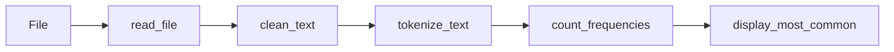

## 🏗️ Module 2B: Code Design & Quality Practices

> **Overview:** This module focuses on software engineering best practices to transform working code into maintainable, professional-quality code.

## 📋 Table of Contents

I. Foundational Code Design

- [2.6 Modular Design with Functions](#26-modular-design-with-functions)
- [2.7 Input Validation and Error Handling](#27-input-validation-and-error-handling)

II. Code Quality & Maintainability

- [2.8 Performance Considerations](#28-performance-considerations)
- [2.9 Code Style and Consistency](#29-code-style-and-consistency)
- [2.10 Testing Mindset](#210-testing-mindset)
- [2.11 Configuration and Flexibility](#211-configuration-and-flexibility)
- [2.12 Documentation Standards](#212-documentation-standards)

---

## I. Foundational Code Design

## 2.6 Modular Design with Functions {#26-modular-design-with-functions}

### 🎯 Learning Objective-modular-design

Understand how to structure code using functions for maintainability and reusability.

### 💡 Core Concept: Why Functions Matter

| Benefit | Description | Example |
|---------|-------------|---------|
| **Readability** | Each function has clear purpose | `clean_text()` vs inline cleaning |
| **Reusability** | Use same logic multiple times | Call `read_file()` for different files |
| **Organization** | Logical separation of concerns | File ops separate from text processing |
| **Debugging** | Isolate and test components | Test `tokenize_text()` independently |

### ✅ Function Design Principles

#### 1. Single Responsibility

```python
# ✅ Good: Does one thing well
def read_file(filepath):
    """Only reads files."""
    pass

def clean_text(text):
    """Only cleans text."""
    pass

# ❌ Bad: Does multiple things
def read_and_clean_file(filepath):
    """Reads AND cleans - too many responsibilities."""
    pass
```

#### 2. Clear Naming

```python
# ✅ Descriptive names
def count_frequencies(tokens):
    pass

# ❌ Unclear names
def count_stuff(data):
    pass
```

#### 3. Comprehensive Documentation

```python
def clean_text(text):
    """
    Converts text to lowercase and removes punctuation.

    Args:
        text (str): The input text to clean

    Returns:
        str: The cleaned text with lowercase letters only

    Raises:
        TypeError: If input is not a string
        
    Example:
        >>> clean_text("Hello, World!")
        'hello world'
    """
    # Implementation here
```

### 🏗️ Our Pipeline Functions



---

## Additional Best Practices & Guidelines

### 2.7 Input Validation & Error Handling {#27-input-validation-and-error-handling}

#### 🎯 Learning Objective-input-validation

Build robust functions that handle edge cases and invalid inputs gracefully.

#### 🔧 Validation Patterns

**File Operations:**

```python
def read_file(filepath):
    """Robust file reading with comprehensive error handling."""
    # Input validation
    if not filepath:
        raise ValueError("Filepath cannot be empty")
    
    try:
        with open(filepath, 'r', encoding='utf-8') as f:
            return f.read()
    except FileNotFoundError:
        print(f"Error: File '{filepath}' not found")
        return ""
    except UnicodeDecodeError:
        print(f"Error: Cannot decode file '{filepath}'")
        return ""
    except PermissionError:
        print(f"Error: Permission denied for '{filepath}'")
        return ""
```

**Type Checking:**

```python
def clean_text(text):
    """Type-safe text cleaning."""
    if not isinstance(text, str):
        raise TypeError(f"Expected string, got {type(text)}")
    
    if not text.strip():  # Handle empty/whitespace-only strings
        return ""
    
    # Core logic here
    return processed_text
```

---

## II. Code Quality & Maintainability

### 2.8 Performance Considerations {#28-performance-considerations}

#### 🎯 Learning Objective-performance-considerations

Write efficient code that scales well with larger datasets.

#### 🔧 Optimization Techniques

**String Operations - Efficiency Comparison:**

```python
# ❌ Slow: Multiple string replacements
def clean_text_slow(text):
    for char in string.punctuation:
        text = text.replace(char, ' ')  # Creates new string each time
    return text.lower()

# ✅ Fast: Single translation operation
def clean_text_fast(text):
    translator = str.maketrans('', '', string.punctuation)
    return text.translate(translator).lower()
```

**Memory Management:**

```python
# For large files, consider streaming
def process_large_file_streaming(filepath):
    """Process file line by line to manage memory."""
    word_counter = Counter()
    
    with open(filepath, 'r', encoding='utf-8') as f:
        for line in f:  # Process one line at a time
            tokens = tokenize_text(clean_text(line))
            word_counter.update(tokens)
    
    return word_counter
```

### 2.9 Code Style & Consistency {#29-code-style-and-consistency}

#### 🎯 Learning Objective-code-style

Write maintainable code following Python conventions.

#### 🔧 Style Guidelines

**Variable Naming (PEP 8):**

```python
# ✅ Good: Snake case, descriptive
file_content = read_file(input_filepath)
cleaned_text = clean_text(file_content)
word_tokens = tokenize_text(cleaned_text)
frequency_counter = count_frequencies(word_tokens)

# ❌ Poor: Unclear, inconsistent
data = read_file(fp)
x = clean_text(data)
lst = tokenize_text(x)
```

**Import Organization:**

```python
# 1. Standard library imports
import string
from collections import Counter
from pathlib import Path

# 2. Third-party imports
import numpy as np
import requests

# 3. Local application imports
from utils import helper_function
```

### 2.10 Testing Mindset {#210-testing-mindset}

#### 🎯 Learning Objective-testing-mindset

Write testable code and think about edge cases.

#### 🔧 Test-Driven Thinking

**Edge Cases to Consider:**

```python
def clean_text(text):
    """Test cases to verify:
    
    Normal cases:
    - "Hello, World!" → "hello world"
    - "Python3.9" → "python39"
    
    Edge cases:
    - "" → ""
    - "!!!" → ""
    - "   " → ""
    - None → TypeError
    - 123 → TypeError
    """
    # Implementation with edge case handling
```

**Example Test Structure:**

```python
# Test normal operation
assert clean_text("Hello, World!") == "hello world"

# Test edge cases
assert clean_text("") == ""
assert clean_text("!!!") == ""

# Test error conditions
try:
    clean_text(None)
    assert False, "Should raise TypeError"
except TypeError:
    pass  # Expected behavior
```

### 2.11 Configuration & Flexibility {#211-configuration-and-flexibility}

#### 🎯 Learning Objective-configuration-flexibility

Design functions that can be easily customized for different use cases.

#### 🔧 Flexible Function Design

**Configurable Parameters:**

```python
def display_most_common(frequencies, n=10, show_count=True, format_style='list'):
    """Flexible display with multiple options."""
    if not isinstance(frequencies, Counter):
        raise TypeError("frequencies must be a Counter object")
    
    print(f"Top {n} most common words:")
    
    for word, count in frequencies.most_common(n):
        if format_style == 'list':
            if show_count:
                print(f"- {word}: {count}")
            else:
                print(f"- {word}")
        elif format_style == 'table':
            print(f"{word:<15} {count:>5}" if show_count else f"{word}")
```

**Constants for Magic Numbers:**

```python
# Configuration constants
DEFAULT_TOP_WORDS = 10
DEFAULT_ENCODING = 'utf-8'
CHUNK_SIZE_MB = 1

# Use in functions
def read_file(filepath, encoding=DEFAULT_ENCODING):
    # Implementation
    pass
```

### 2.12 Documentation Standards {#212-documentation-standards}

#### 🎯 Learning Objective-documentation-standards

Write comprehensive documentation that serves as both specification and guide.

#### 🔧 Enhanced Docstring Format

```python
def count_frequencies(tokens):
    """
    Counts the frequency of each token in a list.

    This function creates a frequency distribution of words, which is
    fundamental for text analysis tasks like finding the most common
    words or analyzing vocabulary usage patterns.

    Args:
        tokens (list[str]): List of word tokens to count. Each element
                           should be a string representing a word.
                           Empty list is acceptable and returns empty Counter.

    Returns:
        collections.Counter: A Counter object mapping each unique word
                           to its frequency count. Keys are strings (words),
                           values are integers (counts).

    Raises:
        TypeError: If tokens is not a list or contains non-string elements.

    Example:
        >>> from collections import Counter
        >>> count_frequencies(['the', 'cat', 'the', 'dog'])
        Counter({'the': 2, 'cat': 1, 'dog': 1})
        
        >>> count_frequencies([])
        Counter()

    Note:
        The function assumes tokens are already cleaned and normalized.
        For best results, pass tokens through clean_text() first.

    See Also:
        tokenize_text(): For converting text to tokens
        clean_text(): For preprocessing text before tokenization
    """
    if not isinstance(tokens, list):
        raise TypeError("tokens must be a list")
      if not all(isinstance(token, str) for token in tokens):
        raise TypeError("All tokens must be strings")
    
    return Counter(tokens)
```
